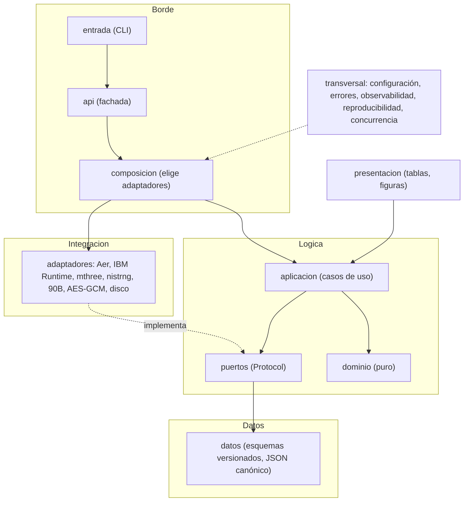

# QRecauda

[](https://github.com/jramirezgen/qrecauda/actions/workflows/ci.yml)
[](LICENSE)
[](.python-version)

Pipeline reproducible de generación de claves a partir de un circuito QRNG simulado, con un caso de uso de recaudación (peaje y Metro de Lima). Nació en el Track 4 del Hackatón Qiskit IBM Lima.

Nivel de madurez (TRL): **3**. Lo que se probó es el postprocesamiento: mitigación de lectura, extracción de entropía, validación estadística y cifrado AES-GCM. El simulador no aporta entropía cuántica y no hay corrida en hardware IBM. Los detalles están en [Limitaciones](#limitaciones).

## Qué problema aborda

Un generador de claves para cobros debe ser impredecible. Un generador clásico seudoaleatorio se predice si alguien conoce su estado. Una fuente cuántica evita ese problema, pero sus bits salen sesgados y correlacionados, y una batería estadística no distingue una fuente buena de un buen PRNG.

QRecauda arma la cadena completa y mide cada etapa:

```
FuenteDeBits -> [Mitigador] -> Peres -> Toeplitz (LHL) -> Validador -> Clave -> AES-GCM
```

Cada cifra del proyecto sale de una corrida con nombre, registrada en `registro/`. Los umbrales de éxito se fijaron por escrito antes de correr (`docs/preinscripciones/`).

## Resultado

| experimento | qué mide | veredicto | cifra registrada |
|---|---|---|---|
| E1 | pipeline con fuente simulada, métricas M1 a M5 | CUMPLE, condicionado | La clave sin mitigar también pasa M1 a M5, así que esas métricas no prueban el valor de la mitigación ni el origen. |
| E2 | mitigación de lectura | CUMPLE | El twirling propio baja el sesgo de lectura entre 11 y 32 veces sobre ruido modelado. ZNE y PEC no mueven el sesgo de lectura. |
| E3 | tasa (M6) y latencia (M7) | **NO CUMPLE** | M6 de 180 a 195 kbit/s (umbral 10 kbit/s, cumple). M7, p95 de 5,5 a 9,4 s frente a 500 ms: falla en las tres semillas. |

E3 falla por M7. El veredicto queda en el registro y no se reabre. La reserva asíncrona de claves (E3b, versión 0.2.0) está en curso: se preinscribe como experimento nuevo con sus propios umbrales antes de correr. Todavía no hay resultado de E3b.

## Estado

| componente | TRL | nota |
|---|---|---|
| Dominio (Peres, Toeplitz) | 4 | aritmética pura, tres semillas preinscritas |
| Mitigación de lectura (twirling propio) | 4 | sobre ruido modelado, no real |
| Validación (NIST SP 800-22 y 90B) | 4 | con control positivo y negativo |
| Fuente simulada con ruido (Aer) | 3 | Aer muestrea con un PRNG |
| ZNE y PEC | 3 | sin efecto medido sobre el sesgo de lectura |
| Cifrado AES-GCM | 3 | falta una latencia de transacción que cumpla M7 |
| Fuente real (hardware IBM) | 3 | sin corrida, `job_id` nulo |
| **Sistema** | **3** | la fila más baja, no el promedio |

La tabla completa y su derivación están en [`docs/TRL.md`](docs/TRL.md). El camino a TRL 4 y 5 está en [`docs/ROADMAP.md`](docs/ROADMAP.md).

## Instalación

Necesitas [uv](https://docs.astral.sh/uv/) y Python 3.13.

```bash
git clone https://github.com/jramirezgen/qrecauda.git && cd qrecauda
uv sync --group dev
```

Eso instala el núcleo (numpy y scipy). Los adaptadores pesados son extras opcionales: `cuantico`, `mitigacion`, `validacion`, `cifrado`, `informe`. La guía [`docs/USO.md`](docs/USO.md) explica cuál necesita cada tarea.

## Uso rápido

CLI. Sin subcomando genera una clave con el PRNG de línea base y devuelve el código de salida 0 si el veredicto aprueba:

```bash
uv run qrecauda                       # tabla de métricas M1 a M7
uv run qrecauda --formato json        # lo mismo en JSON
uv run qrecauda juzgar E3             # aplica el criterio preinscrito a la corrida registrada
```

API de Python:

```python
from qrecauda import api

resultado = api.generar_clave(api.Configuracion(backend="prng"))
print(resultado.veredicto.aprobado)   # True
print(len(resultado.clave))           # bits de clave, dimensionados con la min-entropía
```

`correr` (declaración TOML a corrida registrada), las opciones de configuración y los códigos de salida están en [`docs/USO.md`](docs/USO.md).

## Arquitectura

Cuatro macro-capas sobre puertos y adaptadores. El dominio no hace I/O ni importa ningún SDK, y siete contratos de `import-linter` lo hacen cumplir en cada ejecución de la CI.



El detalle, con la regla de imports de cada capa y el test que la protege, está en [`docs/DISENO.md`](docs/DISENO.md).

## Estructura del repo

| ruta | contenido |
|---|---|
| `src/qrecauda/` | paquete: `dominio`, `puertos`, `datos`, `aplicacion`, `adaptadores`, `presentacion`, `transversal`, `entrada`, `api.py`, `composicion.py` |
| `tests/` | pruebas por capa y tests de arquitectura (contratos, trinquetes, TRL) |
| `declaraciones/` | experimentos E1, E2 y E3 en TOML, fijados antes de medir |
| `docs/preinscripciones/` | umbral y criterio de cada experimento, escritos antes de la corrida |
| `registro/` | corridas, veredictos y estado de nodos (solo se añade) |
| `plan/` | DAG del proyecto y su verificador |
| `notebooks/` | `qrecauda.ipynb`, genera las tablas del informe |
| `spikes/` | investigaciones acotadas (S.01 a S.04), incluida la compilación del 90B |
| `scripts/` | CI local, hooks de git, limpieza del entorno |
| `docs/` | fundamento, diseño, amenazas, TRL, roadmap, glosario, decisiones, informes |

## Reproducir los resultados

```bash
uv sync --frozen --group dev --extra informe
.venv/bin/jupyter nbconvert --to notebook --execute --inplace notebooks/qrecauda.ipynb
.venv/bin/qrecauda juzgar E1       # E2 y E3 igual: rejuzga sobre las corridas registradas
```

Volver a correr un experimento completo (`qrecauda correr declaraciones/E1.toml`) necesita los cuatro extras, el binario del estimador 90B compilado y una máquina sin carga. [`docs/USO.md`](docs/USO.md) lo explica paso a paso.

## Plan y registro

El plan es un grafo acíclico de 59 nodos (`plan/`), todos cerrados para la versión 0.1.0. El estado vive en `registro/nodos.jsonl` y `ESTADO.md` se genera de él. Un nodo se cierra con un commit que toca su entrega. Para ver el estado: `python3 plan/dag.py estado`; para ver qué sigue: `python3 plan/dag.py siguiente`. Si quieres contribuir, empieza por [`CONTRIBUTING.md`](CONTRIBUTING.md) y [`RETOMA.md`](RETOMA.md).

## Limitaciones

- Aer muestrea con un PRNG. Pasar la batería NIST prueba el postprocesamiento, no el origen de los bits.
- No hay corrida en hardware IBM. Que el modelo de ruido propio reproduzca el ruido físico y que la mitigación funcione sobre ruido real quedan sin probar.
- La clave se dimensiona con min-entropía MCV, que supone bits independientes. Con correlación temporal la longitud se sobrestima. Una fuente Markov de prueba produjo una clave unas tres veces más larga de lo que la fuente sostiene.
- M7 falla: la latencia por transacción supera 500 ms. Los 500 ms y los 10 kbit/s vienen del manifiesto del equipo, no de un operador real.
- El registro de nonces vive en la memoria del proceso y no protege entre procesos. No hay gestión de claves (KMS o HSM), ni protección del canal, ni anti-replay.
- NIST SP 800-22 es una batería estadística y SP 800-90B una cota empírica. Ninguna es una certificación FIPS, ISO o Common Criteria.

El modelo de amenazas completo está en [`docs/AMENAZAS.md`](docs/AMENAZAS.md). Para reportar un problema de seguridad, ver [`SECURITY.md`](SECURITY.md).

## Cómo citar

Hay metadatos en [`CITATION.cff`](CITATION.cff); GitHub los ofrece en el botón «Cite this repository». Autor: kaitokid, versión 0.1.0. El informe técnico está en `docs/paper/`.

## Licencia

Apache-2.0. Ver [`LICENSE`](LICENSE). Las contribuciones siguen [`CODE_OF_CONDUCT.md`](CODE_OF_CONDUCT.md).
