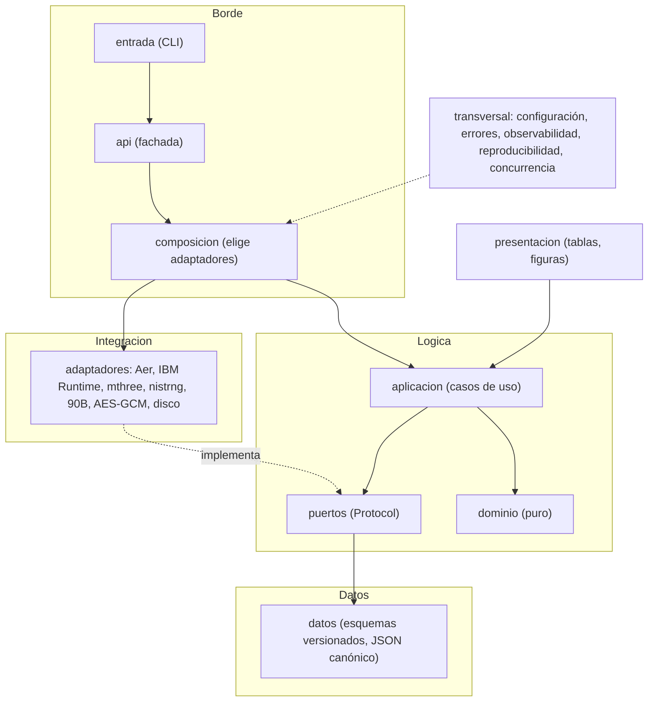

# QRecauda

[](https://github.com/jramirezgen/qrecauda/actions/workflows/ci.yml)
[](LICENSE)
[](.python-version)

**La aleatoriedad clásica se predice. La recaudación del Perú no debería.**

QRecauda es un pipeline reproducible que convierte los bits de un circuito cuántico en claves de cifrado para cobros masivos (peaje y Metro de Lima), y mide cada etapa de la cadena. Hoy corre en simulador y está diseñado para recibir, por el mismo puerto, bits de una computadora cuántica de IBM. Nació en el Track 4 del Hackatón Qiskit IBM Lima.

## Por qué importa

Cada cobro es una transacción pequeña que se firma y se cifra con una clave y un *nonce*. Si el generador que los produce es pseudoaleatorio, quien reconstruye su estado reproduce las claves siguientes. El volumen que depende de eso es grande:

- **Metro de Lima, L1:** 203,9 millones de pasajeros en 2025, un récord (*verificado*, [energiminas](https://energiminas.com/?p=48912)). Más de 600 000 usuarios por día (*tercero*).
- **Peajes:** 24,6 millones de vehículos en el primer cuatrimestre de 2021, el único dato nacional hallado (*tercero*, desactualizado, sin cifra de recaudación, [andina](https://andina.pe/agencia/noticia-ositran-trafico-vehicular-crece-24-carreteras-concesionadas-852013.aspx)).

Las fuentes completas y su etiqueta están en [`docs/pitch/IMPACTO.md`](docs/pitch/IMPACTO.md).

**Lo que no se afirma.** Ninguna norma que revisamos (Ley 29733 con su DS 016-2024-JUS, SBS Res. 504-2021, reglamento del MTC) exige un QRNG; piden medidas técnicas de seguridad (*tercero*). El argumento de QRecauda es de ingeniería: la entropía de la fuente se mide, no se supone. Para eso se apoya en NIST SP 800-90B (estimación de entropía de la fuente) y SP 800-90C (construcción de generadores, versión final del 2025-09-25, *verificado*). NIST SP 800-22 se usa sólo como chequeo de regresión del postprocesamiento: en 2022 NIST aclaró que no sirve para validar generadores aleatorios criptográficos (*tercero*), y aquí lo confirmamos, porque una clave de PRNG y una de fuente sesgada la pasan igual.

## Qué hay hoy y qué añade la computadora de IBM

| | hoy, en simulador | lo que añade la computadora cuántica de IBM |
|---|---|---|
| Fuente de bits | Qiskit Aer, circuito de un gate sobre ocho qubits | mediciones de un dispositivo real, con `job_id` trazable |
| Origen de la entropía | un PRNG: sin valor de seguridad | proceso físico de medición, **no certificado** (no hallamos un QRNG certificado de IBM) |
| Ruido de lectura | modelado (sesgo crudo de 0,03 en el nivel medio) | ruido real, posiblemente asimétrico, correlacionado y con deriva |
| Mitigación | twirling propio medido sobre ruido modelado; ZNE y PEC no mueven el sesgo | comprobar que funciona sobre ruido real y compararlo con `mthree` y con las opciones de IBM (⚠️ sin verificar) |
| Validación | NIST 800-22 y 90B sobre las etapas; control de fuente Markov | 90B sobre los bits crudos del dispositivo, que es lo que informa sobre la fuente |
| Latencia | M7 cumple con la clave de una reserva generada aparte (E3b); sin cola ni red de IBM | sumará latencia de cola y de red, hoy fuera de M7 |
| Qué se puede afirmar | que el postprocesamiento y su medición funcionan | nada nuevo hasta que corra E1 y E2 sobre esa fuente con tres semillas |

## Demo en 2 minutos

> `qrecauda demo` es nuevo en 0.2.0: no existía en 0.1.0. Corre con Aer y sin red; la salida lleva el rótulo «simulado: Aer es pseudoaleatorio, sin origen cuántico».

Necesita los extras de la instalación completa (ver [Instalación](#instalación)); con sólo `uv sync --group dev` no corre. Después de instalarlos, lánzala sin que `uv` los quite:

```bash
.venv/bin/qrecauda demo              # o: uv run --no-sync qrecauda demo
.venv/bin/qrecauda demo --rapido     # menos disparos
```

Tiempo: sin medir, ni en la demo completa ni con `--rapido` (⚠️ sin verificar; `--rapido` usa menos disparos). La ayuda de la CLI dice lo mismo. Se probó con Python 3.13.

**Dimensionado de la clave (desde 0.2.0).** La demo usa por defecto el dimensionado `mcv`. El dimensionado conservador de E5 se activa con `qrecauda demo --dimensionado conservador` (valores: `mcv`, `conservador`); sigue siendo opt-in.

Muestra tres ramas lado a lado: un PRNG clásico, la fuente de Aer sin mitigar y la fuente de Aer mitigada. La mitigación limpia la entrada (el sesgo de la muestra baja de 0,03 a cuatro diezmilésimas), pero la clave de las tres ramas pasa la batería: por eso la batería no prueba el origen. La figura sale de las corridas registradas con `presentacion/figura_demo.py` y está en el [deck](docs/pitch/DECK.md); el [guion de dos minutos](docs/pitch/GUION.md) cronometra la presentación. Además cifra y descifra con AES-256-GCM un peaje y un trayecto de Metro con la clave aprobada. `qrecauda demo --fuente ibm --ensayo` recorre el camino a IBM contra un backend falso (ver [docs/HARDWARE.md](docs/HARDWARE.md)). `qrecauda juzgar E1` rejuzga la corrida registrada. (Los comandos se muestran como `qrecauda ...`; ejecútalos con `.venv/bin/qrecauda` o `uv run --no-sync qrecauda`.)

**Qué es un «veredicto».** Cada experimento fija por escrito, antes de correr, un umbral y un criterio de éxito. El veredicto (`CUMPLE`, `CUMPLE PARCIAL` o `NO CUMPLE`) es la aplicación mecánica de ese criterio a las corridas registradas, por semilla, sin promediar. Un `NO CUMPLE` queda en el registro y no se reabre: un diseño distinto es otro experimento.

**Hardware de IBM, dos comandos** (`docs/HARDWARE.md` lo explica paso a paso; no hay ningún resultado en hardware real):

```bash
scripts/ibm_run.sh ensayo              # sin credencial ni cuota: el camino entero contra un backend falso
scripts/ibm_run.sh real RUTA_TOKEN     # E4: tres trabajos reales; RUTA_TOKEN es la RUTA de un fichero con el token, nunca el valor
```

Estimación de QPU de la corrida real: ≈ 85 s para los tres trabajos (tope por omisión, 120 s). ⚠️ sin verificar: es una estimación, no una medida contra un dispositivo.

**Estado en una línea:** TRL **3**, prototipo de laboratorio. Lo que se probó es el postprocesamiento: mitigación de lectura, extracción de entropía, validación estadística y cifrado AES-GCM. El simulador no aporta entropía cuántica y no hay corrida en hardware IBM: el camino está listo y ensayado contra un backend falso (`qrecauda hardware`, [docs/HARDWARE.md](docs/HARDWARE.md)), pero la corrida real (C.E4) está bloqueada por falta de credencial y **no existe ningún resultado en hardware real**. La tabla honesta de resultados está debajo y los detalles en [Limitaciones](#limitaciones).

## Qué problema aborda

Un generador de claves para cobros debe ser impredecible. Un generador clásico seudoaleatorio se predice si alguien conoce su estado. Una fuente cuántica evita ese problema, pero sus bits salen sesgados y correlacionados, y una batería estadística no distingue una fuente buena de un buen PRNG.

QRecauda arma la cadena completa y mide cada etapa:

```
FuenteDeBits -> [Mitigador] -> Peres -> Toeplitz (LHL) -> Validador -> Clave -> AES-GCM
```

Cada cifra del proyecto sale de una corrida con nombre, registrada en `registro/`. Los umbrales de éxito se fijaron por escrito antes de correr (`docs/preinscripciones/`).

## Resultado

| experimento | qué mide | veredicto | cifra registrada |
|---|---|---|---|
| E1 | pipeline con fuente simulada, métricas M1 a M5 | CUMPLE, condicionado | La clave sin mitigar también pasa M1 a M5, así que esas métricas no prueban el valor de la mitigación ni el origen. |
| E2 | mitigación de lectura | CUMPLE | El twirling propio baja el sesgo de lectura entre 11 y 32 veces sobre ruido modelado. ZNE y PEC no mueven el sesgo de lectura. |
| E3 (0.1.0) | tasa (M6) y latencia (M7), la clave se genera dentro de la transacción | **NO CUMPLE** | M6 de 180 a 195 kbit/s (umbral 10 kbit/s, cumple). M7, p95 de 5,5 a 9,4 s frente a 500 ms: falla en las tres semillas. |
| E3b (0.2.0) | latencia y sostenibilidad con la clave de una reserva generada aparte por un proceso productor | CUMPLE | M7, con la reserva cebada, p95 de 0,17 a 0,18 ms sobre 12 000 transacciones por semilla (umbral 500 ms). Capacidad del productor de 177 a 199 kbit/s; entregado en régimen, 47,8 kbit/s (1,36 veces el consumo declarado de 35,2 kbit/s), sin esperas. Arranque de 6,6 a 6,7 s hasta la primera clave, informado aparte: una transacción que llegue durante él incumpliría M7. No es comparable con E3 (E3 mide generar y cifrar; E3b, sólo cifrar). T2 (M7) era casi trivial por la baja utilización. |
| E5 (0.2.0) | control negativo del pipeline completo con fuentes que dependen de sus bits, y dimensionado conservador | CUMPLE, casi por construcción | Con el dimensionado de 0.1.0 (`mcv`), las nueve claves de fuentes defectuosas pasan M1 a M5 y salen entre 1,2 y 2,5 veces más largas que lo que la fuente sostiene (hallazgo R.00-1 en cadena completa). El dimensionado conservador las acorta (markov_fuerte: de 380 a 381 mil bits con `mcv`, de 55 a 56 mil con el conservador) y la fuente buena conserva de 856 a 883 mil bits. |

Las cifras salen de `registro/corridas/C.E3.json`, `C.E3b.json` y `C.E5.json` y de `registro/veredictos.jsonl`; el cociente de 1,2 a 2,5 se calcula en el veredicto de E5 (criterio HOY) frente al techo teórico de cada fuente.

**Cómo leer E5.** Es casi un control por construcción: las fuentes defectuosas se eligieron detectables por el 90B (control D5); el lado «rechazada» nunca se ejerce (las 36 claves pasan M1 a M5: el pipeline acorta la clave, no la rechaza); y los umbrales K2 y G2 se fijaron tras un diagnóstico con el mismo generador de defectos.

**E3 no se reabre.** Falla por M7 y su veredicto queda en el registro. E3b es otro diseño (la clave sale de una reserva que un proceso productor genera en paralelo), con preinscripción propia anterior a la corrida y veredicto propio; no corrige E3. Su comparación con E3 no es equivalente: E3 mide generar y cifrar la clave dentro de la transacción y E3b sólo cifrar con la reserva ya cebada. Sus límites: se midió sobre simulador, sin la cola ni la red de IBM, sin probar una demanda alta ni arranques en frío adicionales; la demanda (100 transacciones por segundo) la declara el equipo; y las claves se generan con el dimensionado `mcv` de 0.1.0.

**El dimensionado conservador es opt-in.** E5 muestra que el mínimo de MCV y 90B más la contabilidad de la entropía de la fuente acorta las claves de fuentes dependientes; `min(MCV, 90B)` por sí solo no alcanza en markov_fuerte. Por defecto el pipeline sigue con `mcv`, y no se re-midieron E3 ni E3b con el conservador (⚠️ sin verificar su efecto sobre la latencia). E5 prueba tres defectos de dependencia con respuesta analítica, no uno adversarial.

## Estado

| componente | TRL | nota |
|---|---|---|
| Dominio (Peres, Toeplitz) | 4 | aritmética pura, tres semillas preinscritas |
| Mitigación de lectura (twirling propio) | 4 | sobre ruido modelado, no real |
| Validación (NIST SP 800-22 y 90B) | 4 | con control positivo y negativo |
| Fuente simulada con ruido (Aer) | 3 | Aer muestrea con un PRNG |
| ZNE y PEC | 3 | sin efecto medido sobre el sesgo de lectura |
| Latencia con reserva de claves (E3b) | 3 | tres semillas preinscritas, en simulador; 4 sólo con la reserva cebada (el arranque de 6,6 s incumple M7); no sube al sistema |
| Control negativo del pipeline (E5) | 4 | tres defectos de dependencia detectables por el 90B, en simulador |
| Dimensionado conservador (opt-in) | 3 | no integrado por defecto; no se re-midieron E3 ni E3b con él |
| Cifrado AES-GCM | 3 | su fila sólo cita E3 |
| Fuente real (hardware IBM) | 3 | sin corrida, `job_id` nulo; C.E4 bloqueado por falta de credencial |
| **Sistema** | **3** | la fila más baja, no el promedio |

La tabla completa y su derivación están en [`docs/TRL.md`](docs/TRL.md). El camino a TRL 4 y 5 está en [`docs/ROADMAP.md`](docs/ROADMAP.md).

## Instalación

Necesitas [uv](https://docs.astral.sh/uv/) y Python 3.13 (es la versión probada; `pyproject.toml` declara `requires-python >= 3.11`, sin probar).

```bash
git clone https://github.com/jramirezgen/qrecauda.git && cd qrecauda
uv sync --frozen --group dev --extra cuantico --extra mitigacion --extra validacion --extra cifrado
```

Eso instala el núcleo (numpy y scipy) y los cuatro adaptadores que necesitan `qrecauda demo` y los experimentos. Con sólo `uv sync --group dev` queda el núcleo y la demo no corre. El quinto extra, `informe` (matplotlib, jupyter), sólo hace falta para notebooks y figuras. Cada extra y la tarea que lo necesita están en [`docs/USO.md`](docs/USO.md).

`uv run <orden>` sincroniza antes de ejecutar y puede quitar los extras que no pediste en esa llamada: después de instalar, usa `.venv/bin/<orden>` o `uv run --no-sync <orden>`.

## Uso rápido

CLI. Sin subcomando genera una clave con el PRNG de línea base y devuelve el código de salida 0 si el veredicto aprueba:

```bash
.venv/bin/qrecauda                       # tabla de métricas M1 a M7
.venv/bin/qrecauda --formato json        # lo mismo en JSON
.venv/bin/qrecauda juzgar E3             # aplica el criterio preinscrito a la corrida registrada
```

Las opciones globales (`--formato`, `--config`, `--raiz`) van **antes** del subcomando: `qrecauda --formato json juzgar E3`, no `qrecauda juzgar E3 --formato json`.

API de Python:

```python
from qrecauda import api

resultado = api.generar_clave(api.Configuracion(backend="prng"))
print(resultado.veredicto.aprobado)   # True
print(len(resultado.clave))           # bits de clave, dimensionados con la min-entropía
```

`correr` (declaración TOML a corrida registrada), las opciones de configuración y los códigos de salida están en [`docs/USO.md`](docs/USO.md).

## Arquitectura

Cuatro macro-capas sobre puertos y adaptadores. El dominio no hace I/O ni importa ningún SDK, y siete contratos de `import-linter` lo hacen cumplir en cada ejecución de la CI.



El detalle, con la regla de imports de cada capa y el test que la protege, está en [`docs/DISENO.md`](docs/DISENO.md).

## Estructura del repo

| ruta | contenido |
|---|---|
| `src/qrecauda/` | paquete: `dominio`, `puertos`, `datos`, `aplicacion`, `adaptadores`, `presentacion`, `transversal`, `entrada`, `api.py`, `composicion.py` |
| `tests/` | pruebas por capa y tests de arquitectura (contratos, trinquetes, TRL) |
| `declaraciones/` | experimentos E1, E2, E3, E3b, E4 y E5 en TOML, fijados antes de medir (E4, sin correr); `PARAMETROS.toml` es la herencia común |
| `docs/preinscripciones/` | umbral y criterio de cada experimento, escritos antes de la corrida |
| `registro/` | corridas, veredictos y estado de nodos (solo se añade) |
| `plan/` | DAG del proyecto y su verificador |
| `notebooks/` | `qrecauda.ipynb` (tablas del informe) y `qrecauda_vivo.ipynb` (del circuito a la clave cifrada, con `FUENTE` aer o ibm) |
| `spikes/` | investigaciones acotadas (S.01 a S.04), incluida la compilación del 90B |
| `presentacion/` | `figura_demo.py`: figura de la demo de las tres ramas, desde `registro/corridas/` |
| `scripts/` | CI local, hooks de git, limpieza del entorno |
| `docs/` | fundamento, diseño, amenazas, TRL, roadmap, glosario, decisiones, informes; `docs/pitch/` con deck, guion e impacto |

## Reproducir los resultados

```bash
uv sync --frozen --group dev --extra cuantico --extra mitigacion --extra validacion --extra cifrado --extra informe
.venv/bin/jupyter nbconvert --to notebook --execute --inplace notebooks/qrecauda.ipynb
.venv/bin/qrecauda juzgar E1       # E2, E3, E3b y E5 igual: rejuzga sobre las corridas registradas
```

En `registro/corridas/` el sufijo numérico de un nombre como `C.E3b_20261009_e3b_000.json` es la **semilla** de esa corrida (20261007, 20261008 y 20261009), no una fecha.

Volver a correr un experimento completo (`qrecauda correr declaraciones/E1.toml`) necesita los cuatro extras, el binario del estimador 90B compilado y una máquina sin carga. [`docs/USO.md`](docs/USO.md) lo explica paso a paso.

## Plan y registro

El plan es un grafo acíclico (`plan/`); los 59 nodos de la versión 0.1.0 están cerrados y la 0.2.0 (publicada, tag `v0.2.0`; expediente en `docs/releases/EXPEDIENTE_0.2.0.md`) suma E3b y E5, ambos juzgados (el plan tiene hoy 79 nodos; la cifra viva está en `ESTADO.md`). La hoja de ruta de la 0.3.0 es el camino a hardware: C.E4 y E4 siguen abiertos. El estado vive en `registro/nodos.jsonl` y `ESTADO.md` se genera de él. Un nodo se cierra con un commit que toca su entrega. Para ver el estado: `python3 plan/dag.py estado`; para ver qué sigue: `python3 plan/dag.py siguiente`. Si quieres contribuir, empieza por [`CONTRIBUTING.md`](CONTRIBUTING.md) y [`RETOMA.md`](RETOMA.md).

## Enmiendas a las preinscripciones

Todas son fechadas, con su commit, y están en el [informe](docs/paper/paper.md) (sección «Enmiendas fechadas y desviaciones del protocolo»). Ninguna cambia un umbral de M1 a M7.

- **E1, dos enmiendas, ambas antes de la corrida C.E1 (2026-10-07).** La primera pasa M4 de la muestra mitigada a informativa (`1a06602`; M5 ya lo era desde la preinscripción, `dae22a6`). La segunda cambia el criterio del control P1, de «90B de la fuente ideal > 0,9» a «separación del instrumento» (piso 0,8, techo 0,5), tras una calibración con las semillas declaradas (`37b89ca`, `447c907`): la calibración no fue ciega.
- **E3, enmiendas antes de C.E3.** El 2026-10-07: el guard de cifrado juzga sólo M1 a M5 y M1 a M5 de la mitigada pasan a informativas (`09da88c`, `5a72939`). El mismo día de la corrida, 2026-10-08, tres: carga previa de la máquina (`15bd897`), clave rechazada que se regenera y suma a $t_{rep}$ (`8cc0ec1`) y reposo entre semillas (`41cd058`); se hicieron tras un primer intento real sin cifras conservadas, y se declaran como un grado de libertad del investigador.
- **E3, una edición posterior a C.E3.** `d9c9c6d` (2026-10-08, después del veredicto) sólo cambió la redacción de una referencia a E1 en `docs/preinscripciones/E3.md`; no tocó umbrales ni criterios.

## Sobre el historial del repositorio

El repositorio público conserva, en commits anteriores, la autoría con la identidad real de git de quien lo escribió. La historia no se reescribe, porque los sha de esos commits están citados en el registro (`registro/`) y reescribirla los rompería. El **texto** del informe es anónimo (alias «kaitokid»), pero **no se promete anonimato del repositorio**.

## Limitaciones

- Aer muestrea con un PRNG. Pasar la batería NIST prueba el postprocesamiento, no el origen de los bits.
- No hay corrida en hardware IBM. Que el modelo de ruido propio reproduzca el ruido físico y que la mitigación funcione sobre ruido real quedan sin probar.
- Por defecto la clave se dimensiona con min-entropía MCV, que supone bits independientes. Con correlación temporal la longitud se sobrestima: E5 la midió en cadena completa (claves de 1,2 a 2,5 veces lo que la fuente sostiene). El dimensionado conservador la corrige en las tres fuentes de prueba, pero es opt-in y no cubre un defecto adversarial.
- M7 falla en E3 (0.1.0) y cumple en E3b con una reserva de claves, sólo en simulador y sin cola ni red de IBM. Esa reserva en memoria es un depósito de claves que aumenta la exigencia de custodia. Los 500 ms, los 10 kbit/s y los 100 tx/s vienen del manifiesto del equipo, no de un operador real.
- E3b no es comparable con E3 (generar y cifrar frente a sólo cifrar con la reserva cebada) y su arranque de 6,6 s incumpliría M7 para una transacción que llegue durante él; no se probó con una demanda alta ni con arranque en frío adicional.
- E5 es casi un control por construcción: fuentes defectuosas detectables por el 90B, lado «rechazada» no ejercido, umbrales K2 y G2 fijados tras un diagnóstico con el mismo generador de defectos.
- El registro de nonces vive en la memoria del proceso y no protege entre procesos. No hay gestión de claves (KMS o HSM), ni protección del canal, ni anti-replay.
- NIST SP 800-22 es una batería estadística y SP 800-90B una cota empírica. Ninguna es una certificación FIPS, ISO o Common Criteria.

El modelo de amenazas completo está en [`docs/AMENAZAS.md`](docs/AMENAZAS.md). Para reportar un problema de seguridad, ver [`SECURITY.md`](SECURITY.md).

## Cómo citar

Hay metadatos en [`CITATION.cff`](CITATION.cff); GitHub los ofrece en el botón «Cite this repository». Autor: kaitokid, versión 0.1.0. El informe técnico está en `docs/paper/`.

## Licencia

Apache-2.0. Ver [`LICENSE`](LICENSE). Las contribuciones siguen [`CODE_OF_CONDUCT.md`](CODE_OF_CONDUCT.md).
