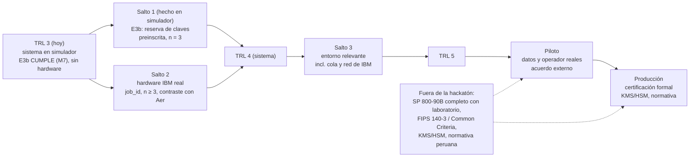

# Roadmap de QRECAUDA: de TRL 3 a producción (F7.04)

> Qué evidencia falta para cada salto y qué la produciría. Parte de `docs/TRL.md`, `docs/preinscripciones/E3.md`,
> D-002, D-007 y D-010. Lo marcado ⚠️ sin verificar es hipótesis, no premisa (FUNDAMENTO). Este documento no contiene
> resultados: ninguna cifra nueva sale de aquí, salen de corridas nombradas en `registro/corridas/`. Actualizado tras E3b y E5
> (versión 0.2.0 en preparación, sin publicar).

## Dónde estamos

El TRL del sistema es **3**, la fila más baja de la matriz. Lo fija, con peso propio, la **fuente real**: no hay corrida en
hardware IBM. `HW.json` es una constancia con `job_id` nulo (D-010). El camino a IBM está listo (`qrecauda hardware`,
`scripts/ibm_run.sh`, `docs/HARDWARE.md`) y ensayado contra un backend falso; la preinscripción P.E4 está escrita y C.E4
está bloqueado por falta de credencial. **No existe ningún resultado en hardware real.**

Lo que cambió desde 0.1.0 (cifras en `registro/corridas/` y `registro/veredictos.jsonl`):

1. **Latencia (M7), cerrada en simulador con otro diseño.** E3 (0.1.0, la clave se genera dentro de la transacción) sigue en
   NO CUMPLE: p95 de 5,5 a 9,4 s frente a 500 ms, y no se reabre. E3b, con la clave de una reserva generada aparte por un
   proceso productor y una preinscripción propia, CUMPLE en las tres semillas (`C.E3b`): p95 de 0,17 a 0,18 ms, productor de
   177 a 199 kbit/s contra 10 kbit/s, sin esperas. El arranque (6,6 a 6,7 s hasta la primera clave) se informa aparte.
   El componente queda en TRL 4 (n = 3, protocolo preinscrito, simulador); no sube al sistema.
2. **Control negativo del pipeline completo (E5, CUMPLE).** El hallazgo R.00-1 se midió en cadena completa: con el
   dimensionado de 0.1.0 las claves de fuentes con dependencia pasan M1–M5 y salen entre 1,2 y 2,5 veces más largas que lo
   que la fuente sostiene (veredicto E5). El dimensionado conservador (mínimo de MCV y 90B más la contabilidad de la
   entropía de la fuente) las acorta; `min(MCV, 90B)` por sí solo no alcanza en la fuente `markov_fuerte`. Es opt-in:
   por defecto sigue `mcv`.

El pipeline de postprocesamiento (extracción, mitigación, validación) está en TRL 4 sobre simulador. Eso no basta para el
sistema: Aer muestrea con un PRNG, así que pasar M1–M5 no prueba origen cuántico (D-002; hallazgo R.00-1: la clave sin
mitigar también pasa).

## Esquema

Los saltos 1 y 2 son independientes y el sistema llega a TRL 4 sólo cuando se cumplen los dos. El 1 está hecho sobre simulador; el 2 espera una credencial.

## Saltos, evidencia, artefacto, coste

| salto | evidencia exigida | nodo o artefacto que la produciría | coste y riesgo |
|---|---|---|---|
| **1. Cerrar M7 (3 → 4 en latencia). HECHO sobre simulador: E3b CUMPLE (`C.E3b`).** Queda medirla con cola y red de IBM, y re-medir con el dimensionado conservador de E5 si pasa a ser el predeterminado (⚠️ sin verificar su efecto sobre la latencia). | Veredicto CUMPLE de una preinscripción nueva (E3b), con N = 30 + 3 por semilla, tres semillas, un hilo, M6 > 10 000 bit/s y M7 < 500 ms. El veredicto de E3 (NO CUMPLE) queda en el registro, append-only; no se reabre. | Rediseño: generación asíncrona de claves y cifrado por reserva, de modo que la transacción consuma una clave ya generada. Nodos nuevos: preinscripción `docs/preinscripciones/E3b.md` y `declaraciones/E3b.toml` (antes de correr), corrida `C.E3b`, decisión que registre el cambio de arquitectura. | Coste de ingeniería medio. Riesgo principal: **mover la medición para cumplir**. El perfil B ya mostró 30–63 mil tx/s sin decidir; E3b tiene que decir de antemano qué se mide (latencia de la transacción con la reserva cargada) y qué se mide aparte (latencia y tasa del reabastecimiento), y no puede tomar B de E3 como prueba. Otros riesgos: agotamiento de la reserva (`EntropiaInsuficiente` debe seguir siendo un resultado, no una excepción tragada) y reutilización de (clave, nonce) entre hilos del productor y el consumidor. |
| **2. Fuente real (3 → 4 en la fuente)** | Corrida con backend IBM: token entregado por ruta (`--token-file`), nunca por valor; **n ≥ 3 corridas, cada una con `job_id`**, backend y versión del SDK; contraste con Aer bajo la misma declaración (misma mitigación, mismas métricas). Se publica el resultado aunque Aer y el hardware difieran o el hardware falle M1–M5. | `qrecauda correr` con la fuente `ibm` (D-010, «Cómo se revertiría»); `registro/corridas/HW.json` pasa de constancia a corrida; la preinscripción P.E4 del contraste ya está escrita y C.E4 espera la credencial el umbral de «difieren» se fija antes (p. ej. qué sesgo de lectura y qué correlación se considera distinta de Aer), y la fila de la fuente se actualiza en `docs/TRL.md`. | Depende de una cuenta de IBM Quantum y de cuota de tiempo de QPU: ⚠️ sin verificar el plan, los límites y el precio vigentes, y no se prometen. Riesgos: la cola y la red entran al reloj (hay que separar el tiempo de cola del tiempo de ejecución y no mezclarlos con M7); el modelo de ruido propio puede no reproducir el hardware (la fila de Aer es TRL 3 por eso); n = 3 corridas puede ser pequeño para ver deriva temporal del dispositivo. |
| **3. TRL 4 → TRL 5 (entorno relevante)** | Todo lo del TRL 4, más: (a) el sistema probado con el flujo de extremo a extremo contra el backend real, con cola y red dentro de la medición; (b) mitigación (twirling, ZNE, PEC) contrastada **sobre ruido real**, hoy ⚠️ sin verificar (D-003); (c) validación 90B y SP 800-22 sobre bits de hardware con control positivo y negativo; (d) un tercero reproduce desde el repo (CI, `requirements.txt`, versiones exactas). | Preinscripción nueva de entorno relevante (E4 cubre el salto 2, no éste) y su corrida; informe de reproducción por un tercero en `docs/informes/`; cierre de la hipótesis de independencia de las semillas de Toeplitz (D-004) con una prueba sobre bloques reales. | Coste medio-alto: más tiempo de QPU y coordinación con quien reproduzca. Riesgo: la definición de «relevante» no está escrita para este proyecto; ⚠️ la rúbrica de TRL 5 no se ha derivado de la evidencia aquí y debe fijarse en una enmienda antes de preinscribir. Sin esa definición, el salto no es verificable. |
| **4. Piloto** | Operador externo (peaje o Metro) acepta un alcance acotado por escrito; datos reales o anonimizados bajo su régimen; requisitos propios del operador para latencia y tasa. Los 500 ms y 10 kbit/s vienen del manifiesto del equipo, no de OSITRAN, MTC ni Metro (⚠️ sin verificar, E3). | Acuerdo de piloto; documento de requisitos del operador; preinscripción de piloto con los umbrales del operador, no los del manifiesto; análisis de riesgos del tratamiento de datos. | Coste alto y fuera del control del equipo: depende de un tercero. Riesgo principal: descubrir que el requisito real difiere del umbral asumido (en cualquier dirección). El canal (TLS, red) y la integración con sus sistemas quedan fuera de FUNDAMENTO y entrarían aquí. |
| **5. Producción** | Certificaciones y controles de las dos secciones siguientes, más operación: monitoreo continuo de la salud de la fuente, rotación y custodia de claves, respuesta a incidentes. | Fuera del repositorio actual: laboratorio acreditado, organización operadora, KMS/HSM. | Coste alto, plazo largo (⚠️ sin estimar). Pasar hoy las pruebas estadísticas no basta: la certificación evalúa también el diseño y la documentación. |

## Certificación formal: no se hace en la hackatón

Ninguna fila de esta sección se da por cumplida ni se insinúa en el pitch. Los datos de procedimiento son de conocimiento
general del autor y **no se verificaron contra las fuentes oficiales (consulta del 2026-10-08)** (⚠️ sin verificar), salvo que se indique.

| tema | qué hay hoy | qué falta |
|---|---|---|
| NIST SP 800-22 | Batería estadística, M1–M5 con `nistrng`. Un PRNG la pasa (D-007). | Nada que certificar: no es una certificación. Se queda como prueba de humo. |
| NIST SP 800-90B | Estimador propio no-IID (F5.02), validado con control positivo (`E1d`); ε = 2⁻⁶⁴ es un parámetro de diseño (AMENAZAS). | Evaluación completa de la fuente de entropía (modelo de la fuente, condicionamiento, pruebas de salud en línea) y, para reclamar conformidad, revisión por un laboratorio acreditado. ⚠️ El alcance exacto y la vía de validación formal de una fuente de entropía no se verificaron. |
| FIPS 140-3 / Common Criteria | Fuera de alcance (FUNDAMENTO, «No incluye»). | Módulo criptográfico validado por un laboratorio, o evaluación Common Criteria del producto. Exige un producto cerrado, documentación de diseño y un patrocinador; el repo actual no es ese producto. ⚠️ sin verificar el esquema aplicable ni el plazo. |
| Gestión de claves (KMS/HSM) | Fuera de alcance: no hay custodia, rotación ni distribución (AMENAZAS). `ReservaDeClave` sólo evita repetir (clave, nonce) dentro del proceso. | Custodia en HSM o KMS, rotación, destrucción, control de acceso a la reserva. El salto 1 (reserva asíncrona) **aumenta** esta exigencia: una reserva en memoria es un depósito de claves. |
| Origen cuántico | No se certifica. Sin pruebas de Bell o autoverificación, ni el hardware prueba origen (FUNDAMENTO, Limitaciones). | Un protocolo de autoverificación (p. ej. basado en violación de Bell) es investigación aparte; no está en este plan. |

## Normativa peruana aplicable

Verificado el 2026-10-08 sólo contra fuentes secundarias (búsqueda web); el texto oficial de cada norma debe leerse antes
de citar un artículo. Este repo no es asesoría legal.

- **Ley 29733 (protección de datos personales).** Exige medidas técnicas de seguridad y confidencialidad apropiadas a la
  categoría de datos. Su reglamento actual es el DS 016-2024-JUS (publicado el 30 de noviembre de 2024, reemplaza al DS 003-2013-JUS);
  fuentes secundarias lo dan en vigor desde el 30 de marzo de 2025 y le atribuyen política de seguridad documentada (art. 47),
  control de acceso (arts. 49 y 50) y registros de interacción lógica. ⚠️ sin verificar: el texto exacto, los plazos de
  notificación de brechas y si el reglamento exige cifrado de forma explícita (la búsqueda no lo mostró).
  Aplica si el piloto trata datos de tarjetas o usuarios. Hoy no se trata ninguno: la transacción de la demo es sintética y
  la tarjeta, pseudónima.
- **Decreto Legislativo 1412 (Gobierno Digital).** Marco de seguridad digital para entidades de la administración pública;
  aplicaría si el operador del piloto es una entidad pública. Fuentes secundarias citan la NTP-ISO/IEC 27001 y la RM 004-2016-PCM
  como base de un sistema de gestión de seguridad de la información (SGSI) en el sector público. ⚠️ sin verificar que esa
  resolución siga vigente en la versión 2022 de la norma ISO.
- **OSITRAN, MTC, Metro de Lima.** No se identificó ningún requisito de latencia, tasa ni de generador de claves en estas
  instituciones. ⚠️ sin verificar. Es el primer dato que debe pedir el salto 4.
- **Sectores no mapeados** (medios de pago con tarjeta, normativa financiera de la SBS, ciberseguridad nacional):
  no investigados. ⚠️ sin verificar si aplican.

## Qué NO se afirma hoy

- Que el sistema esté en TRL 4. Está en 3 (`docs/TRL.md`). El rótulo «TRL 4» del manifiesto no se hereda (discrepancia 7).
- Que E3 cumpla: está en NO CUMPLE y no se reabre. E3b es otro diseño con otro veredicto (CUMPLE, en simulador, con la demanda
  declarada por el equipo y sin cola ni red de IBM); las claves de E3b usan el dimensionado `mcv` de 0.1.0 y no se re-midió con
  el conservador. El 30–63 mil tx/s del perfil B de E3 no decide nada.
- Que el dimensionado conservador sea el predeterminado ni que cubra defectos adversariales: E5 prueba tres defectos de
  dependencia con respuesta analítica conocida.
- Que haya entropía cuántica. Aer es un PRNG; no hay corrida en hardware (D-010). El camino a IBM está listo, pero C.E4
  está bloqueado por falta de credencial.
- Que ZNE, PEC o el twirling propio funcionen sobre ruido real: sólo sobre ruido modelado.
- Que las claves estén «certificadas». Pasar SP 800-22 o tener una cota 90B no es una certificación FIPS, ISO ni Common Criteria.
- Que 500 ms y 10 kbit/s sean los requisitos de un operador real.
- Que haya cumplimiento de la Ley 29733, del DL 1412 o de cualquier norma peruana.
- Plazos, costes en dinero o disponibilidad de cuota en IBM Quantum: no estimados.

## Orden propuesto

1. Hecho: preinscribir y correr E3b (CUMPLE en simulador) y E5 (CUMPLE).
2. Conseguir un token y correr C.E4 con la preinscripción P.E4 ya escrita (`scripts/ibm_run.sh real RUTA_TOKEN`), con n ≥ 3 y `job_id`.
3. Re-medir E3b con el dimensionado conservador y decidir en el release si pasa a ser el predeterminado.
4. Actualizar `docs/TRL.md` con las corridas y recalcular el TRL del sistema; sólo entonces se habla de TRL 4.
5. Definir TRL 5 por enmienda antes de preinscribir una prueba en entorno relevante (cola y red de IBM dentro de M7).
6. Abrir la conversación con un operador: requisitos reales primero, piloto después.
7. Certificaciones y gestión de claves sólo con un producto, un patrocinador y un laboratorio.
